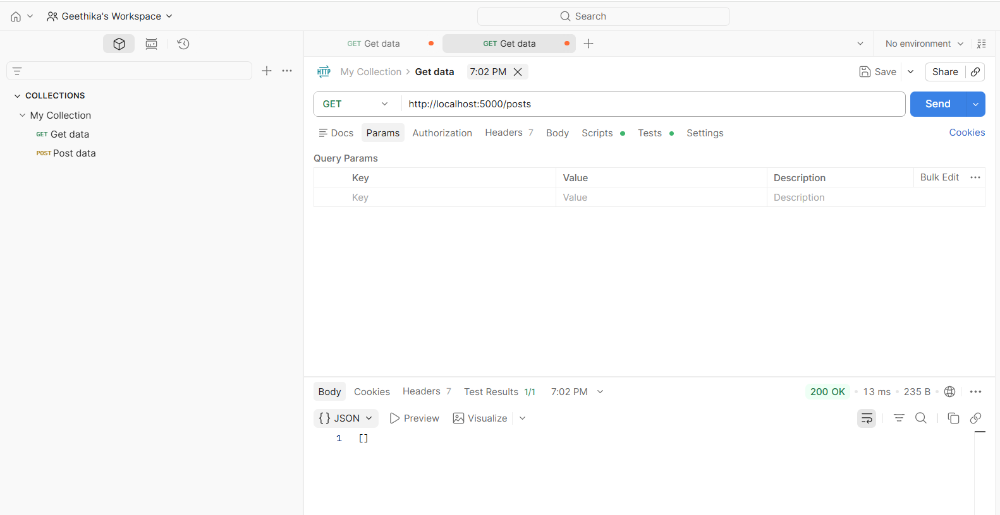
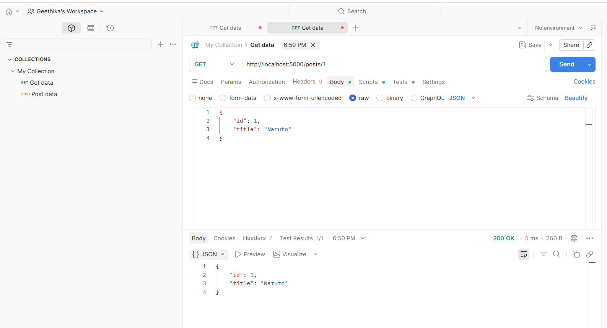
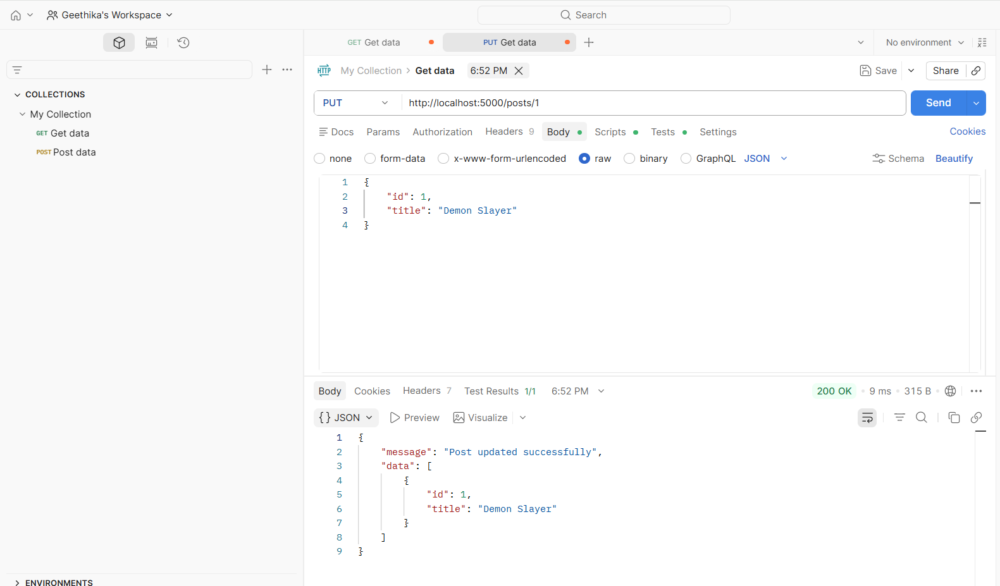
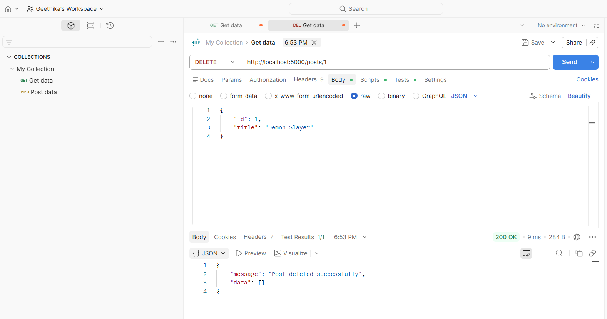
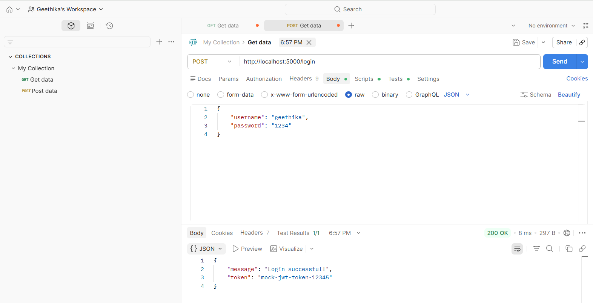
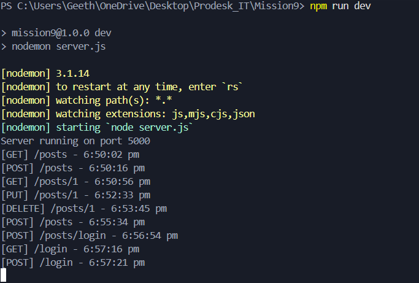

## The Data Hub REST API Server

A RESTful API server built using Node.js and Express.js that performs CRUD operations on blog posts using an in-memory database. The project demonstrates backend routing, middleware handling, REST architecture, and API testing using Postman.

---

## Features

- Express.js server running on Port 5000
- RESTful API endpoints
- CRUD operations for blog posts
- In-memory data storage using arrays
- Custom middleware logger
- Mock authentication endpoint
- API testing using Postman

---

##  Technologies Used

- Node.js
- Express.js
- Nodemon
- Postman

---

## API Improvements

- Added validation for incoming request bodies
- Prevented duplicate blog post IDs
- Added validation for login credentials
- Implemented proper 404 handling for missing resources
- Improved API robustness with defensive programming practices

---

## API Testing

All endpoints were tested successfully using Postman.

### Get all posts

### POST Request

### GET Single Post

### PUT Request

### DELETE Request

### Login Route

### Middleware Logs

---

## Live Demo 

Deployment Link : https://express-rest-api-crud.onrender.com 

---

## Author

- Geethika Kondreddy 
